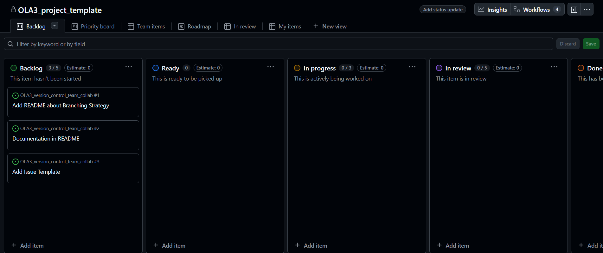

# OLA3_version_control_team_collab

## 1. Branching Strategy 

The branching strategy i have decided for the team is GitHub Flow Strategy. The team is very small (only one person, but lets pretend a few more) and thats why i think GitHub Flow is better suited. 
Github Flow is better suited for a small team for several reasons. Github Flow is very agile and delivers fast because there is a branch for each feature and then only one main branch. Every developer in the team pulls the standard source code / production code from main into a feature branch and start working on that feature. 
Its a fast and easy to implement branching strategy. The con could be that a lot of merge conflicts and complicated ones could happen, however i think that mostly is a concern for bigger teams and not as big a concern for smaller teams, which this is. If/when merge conflicts happenes, it is easier to get them sorted out in a small team. It is however also essensial that we have a High-Frequency Integration in this team to avoid such merge conflicts. The developers in the team should try and integrate the code each day to ensure that the eventual merge conflicts are small and quicker to solve, and follow the principles in Contionous Integration. As Martin Fowler says in his article "The rule of thumb is that “everyone commits to the mainline every day”, or more precisely: you should never have more than a day's work sitting unintegrated in your local repository". And that is what this team should work after. 

## 2. GitHub Projects & Issues

Some issues has been added and workflows has been automated in projects (When a PR is opened → move Issue to In Progress
AND When PR is merged/closed → move Issue to Done)

## 3. Issue and PR template

bug_report, feature_report and pull request template is under .github folder.

## 4. 

#### Sources

(Mostly for myself)

* https://docs.github.com/en/issues/planning-and-tracking-with-projects/customizing-views-in-your-project/customizing-the-board-layout
* https://martinfowler.com/articles/branching-patterns.html (Martin Fowler)
* https://docs.github.com/en/issues/tracking-your-work-with-issues/learning-about-issues/about-issues
* https://www.youtube.com/watch?v=fFrq28RY1SQ (youtube video)
* https://docs.github.com/en/communities/using-templates-to-encourage-useful-issues-and-pull-requests/configuring-issue-templates-for-your-repository
* https://docs.github.com/en/communities/using-templates-to-encourage-useful-issues-and-pull-requests/creating-a-pull-request-template-for-your-repository
